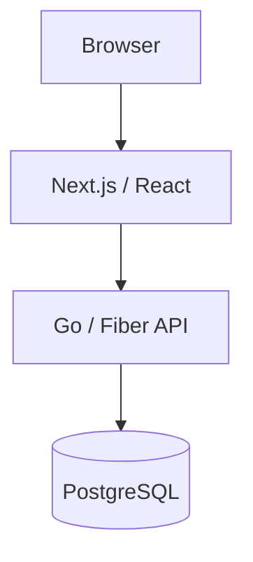

# OpenInvest

OpenInvest is a privacy-first investment portfolio accounting and analytics platform for retail investors.
It records investment activity, reconstructs portfolio state, and calculates portfolio analytics without silently inventing market data.

OpenInvest is not a broker, bank, exchange, trading platform, asset manager, or investment adviser.

## What OpenInvest does

The current product supports authenticated portfolios, an immutable financial ledger, broker CSV import/reconciliation, portfolio positions and acquisition basis, historical holdings, append-only correction/reversal, cash-flow and income analytics, explicit user-supplied valuation, money-weighted return (XIRR), a dividend calculator, and provider-neutral Corporate Actions surfaces.

The canonical ledger supports:

`BUY`, `SELL`, `DIVIDEND`, `COUPON`, `FEE`, `TAX`, `DEPOSIT`, and `WITHDRAWAL`.

## Architecture



The Web layer is presentation-oriented and talks to the Go API.
Financial state and calculations are backend-owned, with PostgreSQL as the canonical persisted data store.

## Demo and current status

**Public demo: not deployed yet.**

The main market-data limitation is deliberate:

> Automated live market prices are not currently an approved production source. Portfolio valuation can use explicit user-supplied RUB prices.

The delayed MOEX market-data adapter remains dormant.
This is an OpenInvest fail-closed source/use decision; it is not a claim that Moscow Exchange rejected the project.

A constrained T-Invest Corporate Actions adapter exists for dividend and bond-coupon reference events, but production provider traffic is not activated. It does not provide brokerage-account synchronization, order placement, trading, or live market prices.

For deeper technical state, start with the
[Source of Truth](docs/SOURCE_OF_TRUTH.md) and
[Architecture Freeze](docs/ARCHITECTURE_FREEZE_v1.2.md).

## Current capabilities

### Accounts and portfolios

- Registration, login, session refresh, and logout are implemented.
- Users can create and inspect portfolios through the Go API and Next.js Web application.
- Portfolio access is isolated by authenticated ownership boundaries.

### Financial ledger

Financial history is append-oriented.
Corrections and reversals preserve the original transaction rather than rewriting historical rows in place.

### Import and reconciliation

User-supplied broker CSV files can be parsed into reviewable candidates, reconciled against existing portfolio history, explicitly approved, and appended through the backend-owned import flow.

### Holdings and accounting

OpenInvest derives open stock and bond positions from ledger history, including:

- quantity;
- weighted-average acquisition cost;
- remaining and total acquisition basis;
- historical positions for an explicit business date;
- correction/reversal-aware effective ledger state.

### Portfolio analytics

Current backend-owned analytics include:

- portfolio cash-flow and income breakdowns;
- gross recorded dividend and coupon income;
- fees and taxes;
- explicit manual portfolio valuation;
- derived market value and unrealized P/L from user-supplied prices;
- money-weighted return using XIRR and exact-date terminal valuation.

### Dividend and Corporate Actions surfaces

The dividend calculator uses user-supplied values and backend decimal arithmetic; it does not require a live market-data provider.

Corporate Actions Calendar and Heatmap API/UI surfaces are implemented around a provider-neutral boundary.
External source activation remains separately governed from the existence of the product surfaces and adapter code.

## Engineering highlights

- **Append-only financial repair.** Correction and reversal preserve ledger auditability instead of mutating historical financial truth in place.
- **Idempotent financial commands.** Write paths preserve command identity and exact response replay semantics for retry safety.
- **Exact financial arithmetic.** Decimal parsing, database numeric bounds, weighted-average cost, valuation, and return calculations avoid binary floating-point financial truth.
- **Historical reconstruction.** Portfolio positions can be reconstructed for an explicit date from the same ledger/accounting boundary used for current holdings.
- **Backend-owned XIRR.** Money-weighted return uses investor cash flows and exact-date terminal valuation with explicit unavailable/fail-closed outcomes.
- **Contract/runtime validation.** OpenAPI validation checks the published contract against shipped Replay routes and keeps intentionally planned operations on an exact allowlist.
- **Security and privacy boundaries.** Authentication, ownership isolation, bounded admission, session/idempotency lifecycle controls, and provider-use restrictions are explicit parts of the design.

## Current limitations

OpenInvest intentionally does not present unfinished or unapproved integrations as active product capabilities.

- No approved automated live market-price source is active in the shipped runtime.
- Market valuation therefore depends on explicit authenticated `USER_SUPPLIED` prices.
- The MOEX ISS quote adapter is implemented but dormant for production/public use.
- The constrained T-Invest Corporate Actions adapter is implemented but runtime activation and production traffic remain separately gated.
- Broker account synchronization, order placement, and trading are not implemented product capabilities.
- Future work such as broader market-data activation, inflation-adjusted returns, tax automation, notifications, and mobile clients must pass their own implementation and source/use gates.

Source/provider status is tracked in the
[Data Source Registry](docs/registries/DATA_SOURCE_REGISTRY.md) and
[Corporate Actions source research](docs/research/CORPORATE_ACTIONS_SOURCE_OUTREACH.md).

## Run locally

### Requirements

- Go `1.25.14`;
- Node.js `>=22.22.2`;
- pnpm `11.8.0` through Corepack;
- Docker / Docker Compose;
- Python `>=3.12` and `uv` only for the full Python verification path.

### Fresh clone

Enable the pinned package manager and install the Web dependencies:

```bash
corepack enable
cd frontend-next
corepack pnpm install --frozen-lockfile
cd ..
```

The default local path uses PostgreSQL `openinvest/openinvest-local` on port `5432` and Redis on
port `6379`. Both `pnpm run bootstrap` and the `dev:api` fallback derive the local PostgreSQL
database identity from `POSTGRES_DB`, `POSTGRES_USER`, `POSTGRES_PASSWORD`, and `POSTGRES_PORT`;
an explicit `DATABASE_URL` still overrides the API fallback. `.env.example` documents optional
overrides and production security boundaries.

Bootstrap infrastructure and the complete current PostgreSQL schema:

```bash
pnpm run bootstrap
```

`bootstrap` validates the repository migration policy, starts PostgreSQL and Redis, discovers every
canonical `infrastructure/postgres/migrations/*.up.sql` migration in deterministic filename order,
and applies the complete set to a fresh database. Re-running it against a database whose schema
already matches the canonical migration set is a safe no-op. A partially initialized or ambiguous
database fails closed; the command never drops or recreates developer data automatically.

Start the API:

```bash
pnpm run dev:api
```

In a second terminal, start the Web application:

```bash
pnpm run dev:web
```

The local Web script points to `http://localhost:8080` by default.

### Verify

```bash
pnpm run verify
pnpm run verify:e2e
```

The E2E smoke path uses the same canonical bootstrap mechanism rather than a historical migration subset.

### Stop local infrastructure

```bash
pnpm run infra:down
```

This stops the normal local containers without deleting the PostgreSQL or Redis volumes.

## Documentation

The README is the product entry point, not the complete engineering record.

### Architecture

- [Source of Truth](docs/SOURCE_OF_TRUTH.md) — current architecture and product/runtime authority.
- [Architecture Freeze v1.2](docs/ARCHITECTURE_FREEZE_v1.2.md) — frozen architecture principles and change boundary.
- [Document Index](docs/DOCUMENT_INDEX.md) — repository documentation map.

### Current state

- [Source of Truth](docs/SOURCE_OF_TRUTH.md) — current product/runtime authority.

### Planning

- [Roadmap](docs/ROADMAP.md) — completed and future planning.
- [MVP Product Risk Refinement](docs/product/MVP_PRODUCT_RISK_REFINEMENT.md) — product-risk decisions and MVP constraints.

### Implementation history

- [Implementation Log](docs/IMPLEMENTATION_LOG.md) — implementation chronology and lifecycle history.

### API

- [OpenAPI contract](openapi/openapi.yaml) — current machine-readable HTTP contract.

### External data

- [Data Source Registry](docs/registries/DATA_SOURCE_REGISTRY.md) — approved, conditional, dormant, and rejected source/use modes.
- [Corporate Actions source research](docs/research/CORPORATE_ACTIONS_SOURCE_OUTREACH.md) — provider evidence and unresolved rights/cost questions.

### Engineering evidence

- [Repository Audit Remediation Register](docs/audit/REPOSITORY_AUDIT_REMEDIATION_REGISTER.md) — canonical index for the original repository audit and its remediation.

## Historical engineering evidence

Detailed implementation chronology, rejected alternatives, remediation rationale, CI evidence, and source-rights research are intentionally preserved outside this README.

Use:

- [Implementation Log](docs/IMPLEMENTATION_LOG.md) for the stage-level implementation index;
- [Historical Feature Forensic Documentation Reconciliation](docs/governance/HISTORICAL_FEATURE_FORENSIC_DOCUMENTATION_RECONCILIATION.md) for deeper feature evidence;
- [Repository Audit Remediation Register](docs/audit/REPOSITORY_AUDIT_REMEDIATION_REGISTER.md) for the original audit closure index;
- `docs/stages/` for individual planning, implementation, closure, remediation, and evidence dossiers.

The historical records are evidence of how the system evolved. They are not a substitute for the current-state authority in
[Source of Truth](docs/SOURCE_OF_TRUTH.md).
