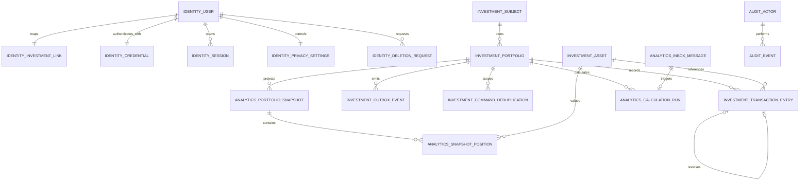

# Stage 2 ER Model Draft

| Field | Value |
| --- | --- |
| Document ID | DB-ER-STAGE-02 |
| Version | 1.0.0 |
| Status | Proposed Logical Model / No SQL Authorized |
| Owner | Principal Architect |
| Supersedes | Conflicting physical table drafts in legacy documents |
| Dependencies | Documents 42–43; ADR-002; ADR-004; ADR-005; ADR-006 |
| Last Review Date | 2026-06-20 |
| Next Review Date | Before Stage 4 migrations |

## Scope and non-goal

This is a logical ER model used to freeze ownership, relationships, invariants, and likely index
access paths. It deliberately contains no DDL, column SQL types, partition syntax, migration, or
ORM mapping. Stage 4 must convert it into reviewed PostgreSQL migrations without changing its
meaning silently.

## Schema ownership

| PostgreSQL schema | Owner | Data class |
| --- | --- | --- |
| `identity` | Identity context | Personal identity, credentials, sessions, privacy choices |
| `investment` | Portfolio/Ledger context | Assets, portfolios, immutable financial entries |
| `analytics` | Analytics context | Rebuildable snapshots and calculation read models |
| `audit` | Audit context | Append-only security and business action evidence |
| `tax` | Future Tax context | Empty placeholder in MVP; no tables authorized |

Schema boundaries are ownership boundaries, not permission shortcuts. Each runtime role receives
least-privilege access only to the schemas and operations it requires.

## Logical relationship diagram



`IDENTITY_INVESTMENT_LINK.investment_subject_id` points logically to
`INVESTMENT_SUBJECT.id`. The database may enforce this with a constrained cross-schema foreign
key while both schemas share one PostgreSQL database, but business code must depend on an identity
port rather than cross-context joins. If schemas move to separate databases, an application-level
integrity protocol replaces the FK without changing domain logic.

## Identity schema

### `identity.users`

Personal account root: opaque user ID, normalized email, account state, language, theme, timezone,
creation/update timestamps, and deletion lifecycle timestamps. Privacy choices are not duplicated
here: `identity.privacy_settings` is their single authority. Passport, INN, phone, address, and
birth date are absent from the MVP account table.

### `identity.credentials`

One-to-one password credential: user ID, Argon2id password hash and parameters, password version,
created/changed timestamps. No plaintext, reversible password, reset token, or password history
content belongs here.

### `identity.sessions`

Rotating refresh-session family: opaque session ID, user ID, hashed refresh-token material,
rotation/reuse state, expiry/revocation timestamps, and minimal device/security metadata. Raw JWTs
and raw refresh tokens are forbidden.

### `identity.privacy_settings`

Authoritative user-controlled privacy defaults and consent versions. New accounts: privacy on, tax
profile off, notifications off, anonymous analytics. Consent evidence stores version/time, not
unnecessary data.

### `identity.user_investment_links`

The only reversible mapping between personal `user_id` and opaque
`investment_subject_id`. One active mapping per account in MVP. It is deleted irreversibly after
the approved deletion grace period. Investment rows never store email or identity IDs.

### `identity.deletion_requests`

Deletion workflow state: request, grace-period expiry, cancellation/completion timestamps, and
workflow status. It must not copy financial history.

## Investment schema

### `investment.subjects`

Opaque financial-history owner. Contains no personal fields. After identity deletion it is marked
anonymous with a system timestamp only after the reversible identity link is destroyed. It remains
the stable owner of retained financial history.

### `investment.assets`

Investment-owned canonical MOEX stock/bond security master and normalized current facts: ticker,
asset type, name, RUB currency, market, lot size, lifecycle status, ISIN, bond maturity/face-value
facts, source code, and source observation timestamp. Provider adapters belong to the External Data
Gateway and may write only through the Investment ingestion port. Provider payloads and unofficial
IDs are not canonical columns, and the gateway owns no separate canonical data schema in MVP.

### `investment.portfolios`

Mutable portfolio metadata: portfolio ID, subject ID, name, RUB base currency, optimistic version,
active/deleted lifecycle timestamps. Financial totals are not stored here.

### `investment.transaction_entries`

Append-only financial ledger. Proposed logical fields:

- `entry_id`: physical immutable entry identity;
- `transaction_id`: stable logical API identity;
- `portfolio_id`, optional `asset_id`;
- `revision`: positive sequence unique per logical transaction;
- transaction type and canonical non-negative magnitudes;
- quantity, unit/gross/commission/tax Money components;
- trade and nullable settlement BusinessDates;
- correction reason and optional prior-entry reference;
- optional `reverses_transaction_id` for a reversal command;
- creation SystemTimestamp and actor/audit correlation identifiers.

No UPDATE or DELETE privilege is granted to the application ledger writer. Current transaction
state is a deterministic projection of entries. A correction appends the next revision. A reversal
appends a distinct transaction referencing the reversed logical transaction.

### `investment.outbox_events`

Transactional outbox rows committed with ledger/portfolio commands: event ID, aggregate identity,
aggregate/business version, versioned event type, payload reference/payload, created/published
timestamps, attempt state. At-least-once transport plus inbox deduplication is mandatory.

### `investment.command_deduplication`

Idempotent financial-command record scoped by principal, method, canonical path, and idempotency
key. Stores canonical request hash, terminal status, response reference/hash, creation and expiry.
It stores no raw token and no unnecessary request body.

## Analytics schema

### `analytics.portfolio_snapshots`

Rebuildable portfolio projection: portfolio ID, snapshot BusinessDate, snapshot version,
methodology version, calculated values/rates, input watermark, calculated timestamp, and status.
Unique identity includes portfolio/date/version/methodology. It is never the canonical ledger.

### `analytics.snapshot_positions`

Per-asset projection for a snapshot: quantity, weighted-average cost, market price/value,
unrealized gain, and portfolio weight. It can be dropped and rebuilt with its parent snapshot.

### `analytics.calculation_runs`

Explainability record: calculation/run ID, portfolio, methodology version, input BusinessDate,
ledger/source watermarks, status, start/completion timestamps, and safe error code. Raw personal
data and rendered reports are forbidden.

### `analytics.inbox_messages`

Subscriber inbox keyed by consumer and event ID. Records event version, receipt/processing state,
attempts, business version, and dead-letter reference. Unique deduplication enforces one business
effect despite at-least-once delivery.

Purchasing-power and dashboard values may be materialized later only if performance evidence
requires it. Stage 2 does not authorize speculative tables.

## Audit schema

### `audit.actors`

Opaque audit actor identity. A reversible link to `identity.users` may exist only inside the
identity boundary and is destroyed during account anonymization. Audit records retain technical
evidence without retaining direct identity fields.

### `audit.events`

Append-only evidence: event ID, opaque actor ID, action code, target kind/opaque ID, outcome,
request ID, trace ID, source IP classification/security metadata, SystemTimestamp, and schema
version. Logs/audit payloads cannot contain passwords, tokens, passport, INN, XML/PDF content,
or unbounded request bodies. Retention is 10 years.

Audit immutability is enforced independently from application logs. Correction is a compensating
audit event, never an UPDATE.

## Tax schema placeholder

`tax` exists as an isolated namespace only. Stage 2 authorizes no tax profile, calculation,
document, XML, PDF, or export tables. Tax Export remains disabled/experimental and requires its
own feature approval, data classification, retention review, threat model, and migrations.

## Relationship invariants

1. Identity knows the opaque investment subject mapping; investment never knows personal identity.
2. Every portfolio belongs to one investment subject.
3. Every transaction entry belongs to one portfolio; an asset link is optional only for RUB cash.
4. Logical transaction revision is unique and strictly increasing.
5. A reversal cannot reference itself and cannot create an unbounded reversal cycle.
6. Snapshots reference portfolio and normalized assets but never become transaction parents.
7. Outbox creation shares the transaction of the business write; inbox processing is idempotent.
8. Audit references opaque IDs and cannot be used as a hidden identity database.

## Draft index inventory

Names are illustrative; access paths and uniqueness are frozen, physical syntax is not.

| Entity | Draft access/constraint |
| --- | --- |
| identity user | unique normalized email where account is active |
| session | user + active/revoked state; unique refresh-token hash |
| identity link | unique user ID; unique investment subject ID |
| asset | unique ticker; unique ISIN where present; type/status/ticker search |
| portfolio | subject + active state + updated timestamp; unique ID/version |
| transaction entry | unique entry ID; unique transaction ID + revision |
| transaction history | portfolio + trade date + entry ID descending |
| asset history | portfolio + asset + trade date + entry ID |
| reversal | reversed transaction ID where non-null |
| outbox | unpublished + created time; unique event ID |
| idempotency | unique principal + method + path + key; expiry cleanup |
| snapshot | unique portfolio + date + snapshot/methodology version |
| snapshot range | portfolio + date descending |
| inbox | unique consumer + event ID; pending/retry schedule |
| audit | actor + timestamp; target + timestamp; request ID; trace ID |

Every index must be justified by a query/constraint and verified with representative plans before
production. Duplicate speculative indexes are forbidden.

## Anonymization sequence

```text
Deletion requested
→ 30-day grace period
→ revoke sessions and stop new writes
→ destroy identity.user_investment_links mapping and its per-subject decryption key material
→ delete personal identity and credentials
→ mark investment subject anonymous without identity material
→ sever audit actor identity mapping
→ replay deletion ledger during any restore; encrypted backups remain unusable for re-identification
```

Transactions, snapshots, and audit evidence remain, but no reasonable technical or organizational
mechanism can reconnect them to the deleted person. Until the reversible link/key is destroyed the
data is pseudonymized, not anonymized. After cryptographic erasure and deletion it is Anonymous
Financial History, including if an older encrypted backup is restored.

## Physical design gate

Before Stage 4 DDL, reviewers must approve exact PostgreSQL types, constraints, RLS/role strategy,
encryption boundaries, partitioning evidence, outbox/inbox state machines, anonymization runbook,
backup interaction, rollback, and migration plan. This document alone authorizes no table creation.
